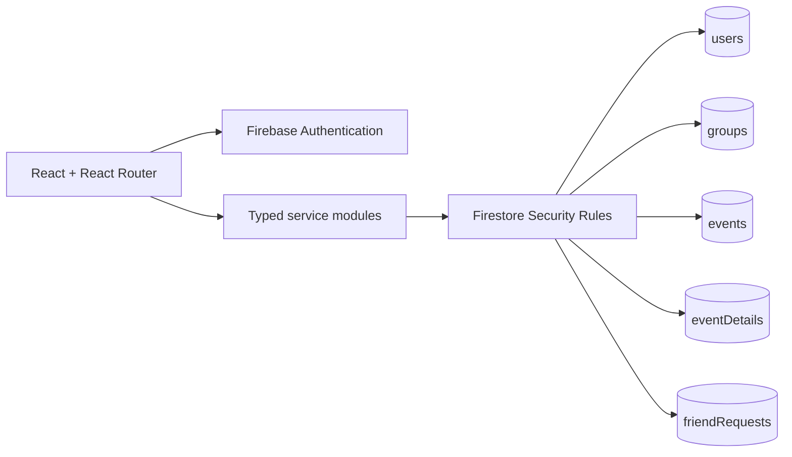

# PeerSchedule

PeerSchedule is a peer-to-peer shared calendar web application built for COMP4650 Web Development. Users sign in with Google, create or join calendars, manage events, connect with friends, invite participants, and share availability.

Its product direction is coordination-first: choose people, see shared free time, pick or vote on a time, and
turn that availability into a plan.

## Team

- Zane Costello — Project management and UI/UX design
- Dominic Avellani — Frontend development and technical lead
- Lucas Bacchi — Firebase Authentication, Firestore, and backend services

## Technology Stack

- React 19 and TypeScript
- React Router Framework Mode
- Tailwind CSS 4
- Firebase Authentication with Google
- Cloud Firestore
- Firebase Hosting
- ESLint and Prettier

## Implemented Features

- Google sign-in and first-time Firestore profile creation
- Protected application pages and sign-out
- Create, list, edit, open, and delete shared calendars
- Calendar ownership and member management
- Responsive month, week, and hourly day calendar views
- Plans dashboard with upcoming plans and unanswered invitations
- Group common-time suggestions using privacy-safe busy blocks
- Multi-option time polls and participant voting
- Create, view, edit, and delete events
- Meeting, open-event, and blocked-time event types
- Full-details, friends-only, and busy-only UI visibility
- Participant invitation and accepted/pending/declined responses
- Open-event join and leave controls
- Friend search, requests, accept/decline, cancellation, and removal
- Account management and display-name editing
- Role-protected admin dashboard
- Loading, empty, success, error, and confirmation states
- Firestore Security Rules and index configuration
- Recurring events with an end date and scoped series deletion
- Indexed, limited user search by display-name or email fragment

## Project Setup

1. Install Node.js 22.22.0 or newer (required by the current React Router version).
2. Clone or extract the project.
3. Install dependencies:

```bash
npm install
```

4. Confirm the Firebase web configuration in `src/lib/firebase.ts` points to the correct Firebase project.
5. In Firebase Console, enable Google as an Authentication provider.
6. Create a Cloud Firestore database.
7. Deploy the included rules and indexes:

```bash
npx firebase-tools deploy --only firestore:rules,firestore:indexes
```

8. Start the development server:

```bash
npm run dev
```

## Available Scripts

```bash
npm run dev       # Development server
npm run build     # Production build
npm run typecheck # React Router type generation and TypeScript checks
npm run lint      # ESLint
npm run test:rules # Firestore Security Rules emulator tests
npm run format    # Prettier formatting
npm run check     # Prettier validation
```

## Main Routes

- `/` — Public home and Google sign-in
- `/plans` — Upcoming plans, invitations, and primary actions
- `/groups` — Group selection and management
- `/groups/:calendarId` — Availability, plans, time voting, and membership
- `/friends` — Friend management
- `/account` — Account management
- `/admin` — Administrator-only dashboard

## Firestore Collections

- `users`
- `groups`
- `events` (public schedule blocks)
- `eventDetails` (protected titles, descriptions, and locations)
- `friendRequests`
- `timePolls`

User documents use the Firebase Authentication UID as the Firestore document ID. Existing early-development user documents with generated IDs are migrated when the user signs in.

## Administrator Setup

New accounts receive the `user` role. To create an administrator for development, update the account's `users/{uid}.role` value to `admin` using the Firebase Console. Do not add a client-side control that allows users to promote themselves.

## Testing

Run the automated checks and test with at least two Google accounts. See
[`TESTING.md`](TESTING.md) for the security suite and required multi-account scenarios.

## Known Limitations

- Restricted event details are stored separately from public busy blocks. Friends-only viewer access is captured when the event is created or edited, so editing an older event refreshes its eligible friend list.
- Recurring event edits currently affect the selected occurrence; deletion supports one occurrence, following occurrences, or the complete series.
- User search depends on `searchTokens`. Existing profiles receive these tokens the next time that user signs in.
- Google Contacts and Google Calendar imports require separate OAuth scopes and are not part of the core project.

## Architecture and Data Flow



Public scheduling blocks live in `events`. Restricted titles, descriptions, and locations live in
`eventDetails`, whose viewer list is independently protected by Firestore Rules. React pages never issue raw
Firestore calls; they use the service layer.

Additional submission material:

- [`docs/ARCHITECTURE.md`](docs/ARCHITECTURE.md)
- [`docs/WIREFRAMES.md`](docs/WIREFRAMES.md)
- [`docs/REFLECTION.md`](docs/REFLECTION.md)
- [`docs/screenshots/README.md`](docs/screenshots/README.md)

## Deployment

The configured Firebase project is `peer-schedule`. After running the checks, deploy with:

```bash
npm run build
npx firebase-tools deploy --only hosting,firestore:rules,firestore:indexes,storage
```

Firebase Hosting normally serves this project at `https://peer-schedule.web.app`; confirm the active URL in
the Firebase Console after deployment.

## Security

Do not commit private service-account files, passwords, or `.env` files. Firebase web configuration identifies the Firebase project but does not replace Firestore Security Rules. The included rules enforce authentication, calendar membership, ownership, RSVP restrictions, and admin permissions.

## Academic Integrity and Credits

The project uses React, React Router, Tailwind CSS, Firebase, ESLint, Prettier, and Firebase Rules Unit
Testing. AI-assisted development was used for implementation review, debugging, calendar UI refinement,
security-rule hardening, and documentation. Team members are responsible for reviewing, understanding, and
being able to explain all submitted code.
