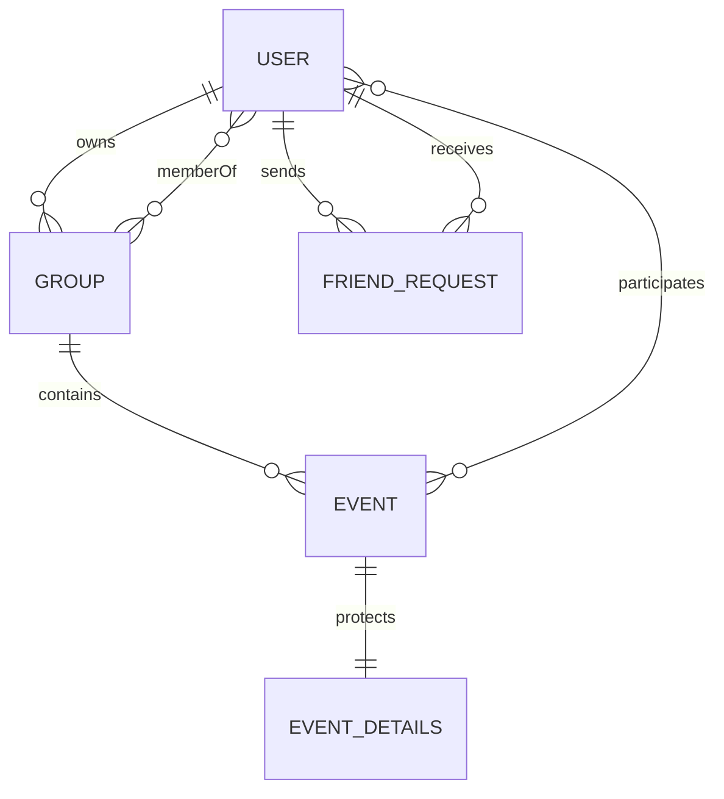

# PeerSchedule Architecture

## Application layers

1. React Router pages own route-level loading and user workflows.
2. Shared components provide navigation, dialogs, and page states.
3. Typed service modules perform every Firebase operation.
4. Firestore Security Rules independently enforce identity, membership, ownership, field validity, and RSVP isolation.
5. Public event schedule blocks and restricted event details use separate collections.

## Firestore relationships

`users/{uid}` stores normalized identity and bounded search tokens. `groups/{id}` stores the owner and unique
member IDs. `events/{id}` stores schedule-safe fields. `eventDetails/{eventId}` stores private text and explicit
viewer IDs. `friendRequests/{sortedUidPair}` provides one relationship document per user pair.

## Privacy boundary

Busy-only and friends-only event titles, descriptions, and locations are never stored in the public event
document. The browser attempts to hydrate `eventDetails`; denied reads remain a generic Busy block.
